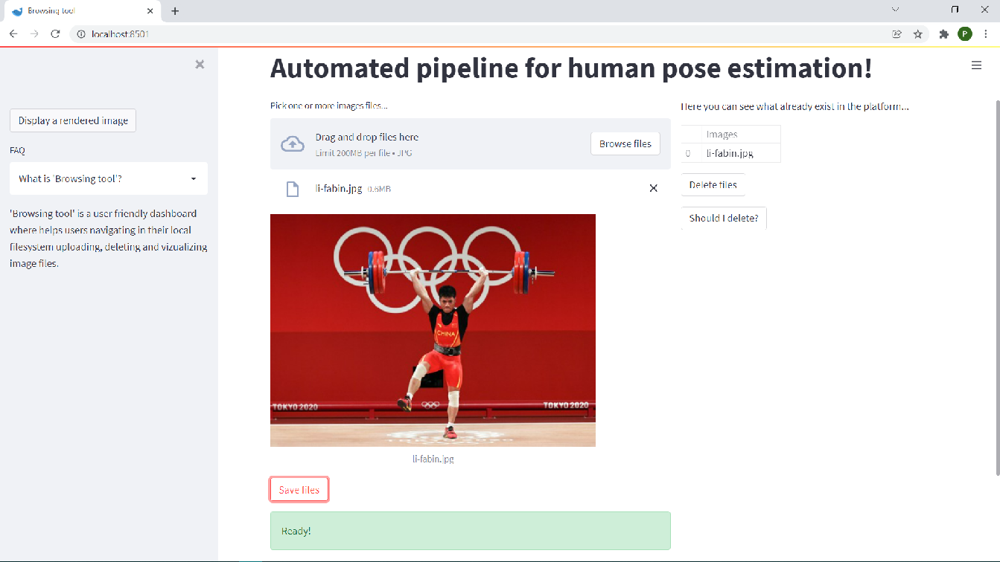
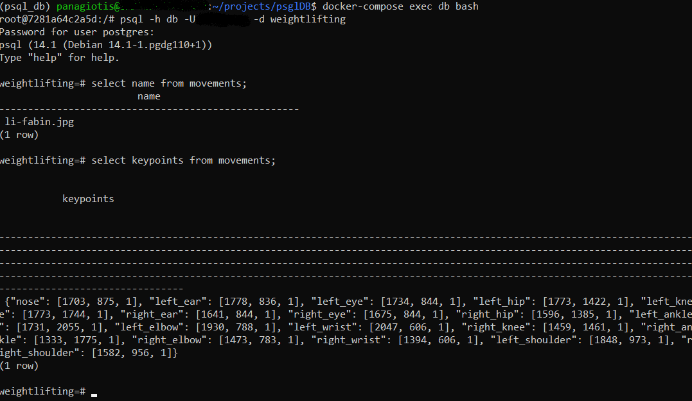

## Automated ETL Tool 

[]()
[](https://www.python.org/downloads/release/python-380/)
[]() 

> "An automated pipeline tool which works like that --> [E]xtract images locally, [T]ranform them applying a 3D human pose estimation model and [L]oad them (+ more details) into PostgreSQL database."

### Quickstart 
Download or clone this [repo.](https://github.com/pan-efs/AutomatedETL_3DHPE)

Install `Docker` on your system, following the [instructions.](https://docs.docker.com/get-docker/)

For formal reasons, the application has been developed in `WSL2 Ubuntu 20.04` and `conda` as package and environment management.

### Step 1: Configuration 
Run the script `config.sh` parsing the following flags:

| Flag         | Values           |
| :---         |     :---:        |
| -u           | username         |
| -p           | password         |
| -d           | database's name  |
| -t           | table's name     |

<details>
  <summary>Explanation</summary>

  ```diff
  - -u, Define the username for the PostgreSQL DBMS.
  - -p, Define the password for the PostgreSQL DBMS.
  - -d, Give a name for the database that would you like to store the data.
  - -t, Give a name for the table into the database which has been created using the above flag. 
  ```

For example, `root$ bash config.sh -u myusername -p mypassword -d mydatabase -t mytable`, where `root` is the path to the repo in your local filesystem.
</details>

After configuration three new files `(db_config.ini, POSTGRES_USER.txt & POSTGRES_PASSWORD.txt)` will appear in your filesystem. It's recommended to keep secret those files due to sensitive information. 

### Step 2: Docker-compose Build/Up Locally 
Run the script `buildup.sh` parsing the following flags:

| Flag         | Values           |
| :---         |     :---:        |
| -b           | yes/YES, no/No   |
| -u           | yes/YES, no/No   |

<details>
  <summary>Explanation</summary>

  ```diff
  + -b, yes/YES, if you want to build the images, otherwise no/NO.
  + -u, yes/YES, if you want to start running the docker containers in the background after building, otherwise no/NO.
  ```

  For instance, the command `root$ bash buildup.sh -b yes -u yes` will build the docker images and then will start running the containers in the background and leaves them running.
</details>

See a synopsis of useful docker-compose commands [here.](https://github.com/pan-efs/AutomatedETL_3DHPE/tree/master/info)

### How it works? 
<details>
  <summary>A short preview</summary>

  
  
  
</details>
<details>
  <summary>Post-building phase</summary>

  1. Start running the docker using `docker-compose up` || `docker-compose up -d`.
  2. `app` service will download and initiliaze the model. This step needs 2-3 minutes.
  3. Then, it will process all images, if exist. Otherwise, it will exit.
  4. When you upload new images, you have to run the service again using the command on step 1.
  5. Running in the background is more convenient.   
</details>

<details>
  <summary>Streamlit Dashboard</summary>
  
  1. Be sure that docker is running!
  2. Open a web browser (i.e. Google Chrome)
     * search for `http://localhost:8501/`
  3. See `FAQ` section in order to find out how the dashboard works.  
</details>

<details>
  <summary>PostgreSQL DB</summary>
  
  1. Be sure that docker is running!
  2. If you need to interact with your database write the below command:
     * `docker-compose exec db bash`
     * psql -h `db` -U `myusername` -d `mydatabase`
  3. The table contains four columns (name CHAR(50), original_img BYTEA, rendered_img BYTEA, keypoints JSONB).
</details>

<details>
  <summary>3D Human Pose Estimation model</summary>
  
  1. More info about the model you can read [here.](https://pytorch.org/vision/master/_modules/torchvision/models/detection/keypoint_rcnn.html)
  2. The `keypointrcnn_resnet50_fpn` is particularly trained to identify key-points in `a person`.
  3. The model infers better if there are no occlusions.   
</details>